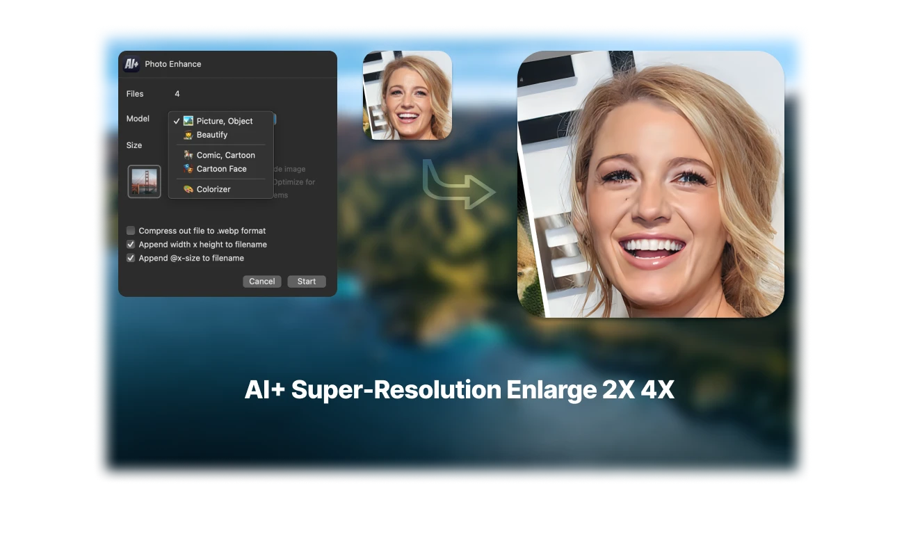
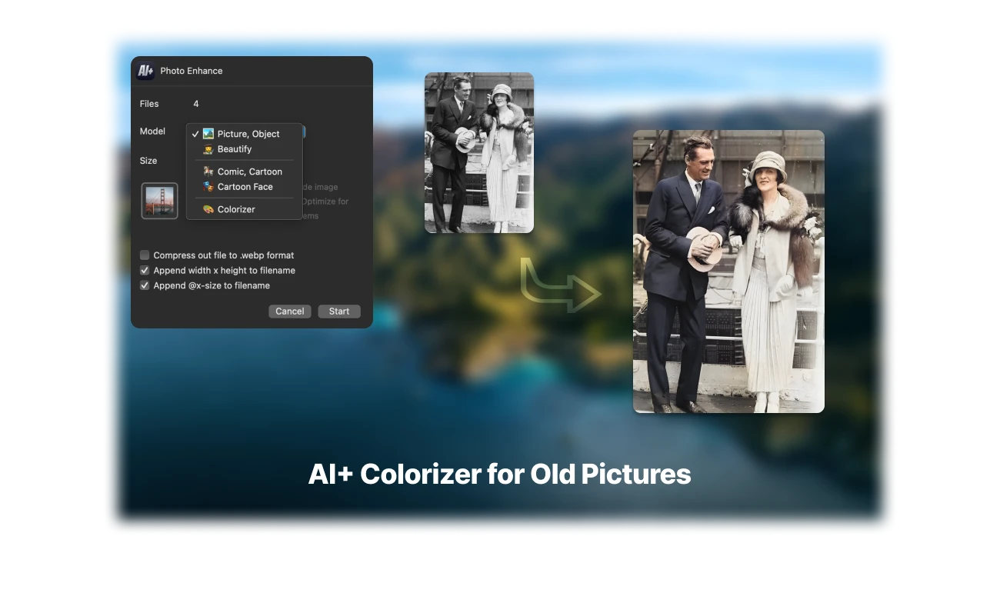
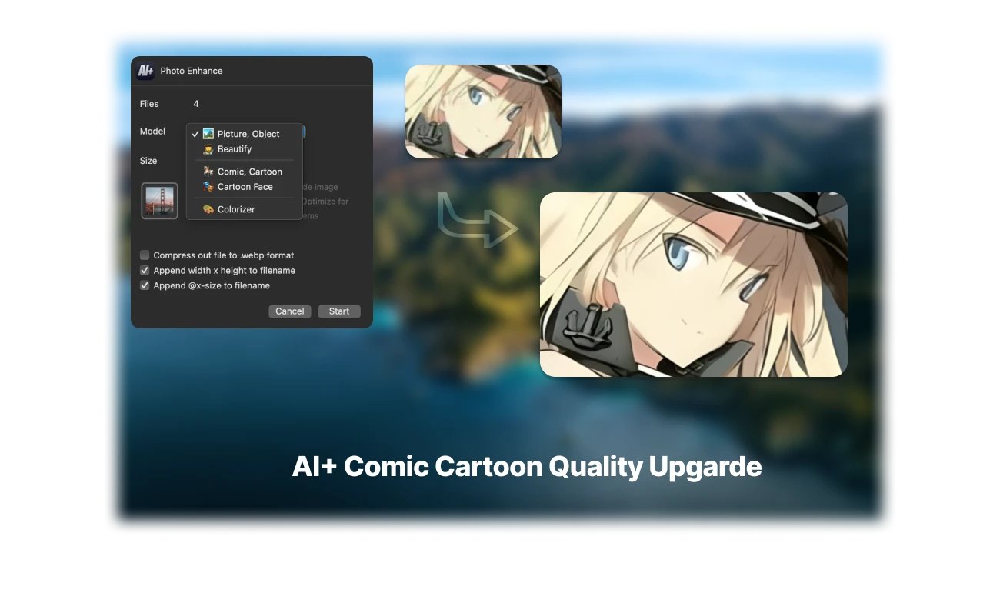

# README.md
- [Deutsch](README.de.md)
- [English](README.md)
- [Spanish](README.es.md)
- [French](README.fr.md)
- [Italian](README.it.md)
- [언어](README.ko.md)
- [日本語](README.ja.md)
- [简体中文](README.zh_cn.md)
- [繁体中文](README.zh_tw.md)

# Quick AI+ - macOS acción rápida para mejorar imágenes: Super-Resolución | Ampliación | Colorización | Estilo de caricatura Avatar  

Descarga [la última versión desde la App Store de macOS](https://apps.apple.com/us/app/id1664742316)  

V3.0  
---  
- Nueva interfaz de la aplicación. Más fácil de procesar tus imágenes  
- Rediseño del nuevo ícono de la aplicación  
- Los modelos de IA no se incluyen en la aplicación. Ahora solo puedes descargar el modelo necesario  
- Soporte para abrir el menú contextual del Finder de macOS para procesar rápidamente imágenes  

V2.3  
---  
- Agregar modelo de IA para desenfocar el fondo y resaltar el retrato  
- Agregar opción de salida al formato avif  
- Solucionar problema de conversión de caras de caricatura con un mejor modelo de IA  
- Solucionar problema de conversión de archivos avif de origen  

V2.2  
---  
- Agregar nuevo modelo para imágenes con mayor optimización de reducción de ruido  
- Corregir algunos tamaños de imagen incorrectos  
- Soporte para varios idiomas  

V2.1  
---  
- Convertir automáticamente a webp cuando el archivo de origen esté en formato .webp  
- Solucionar error en la conversión de imágenes jpg  

V2.0  
---  
- Agregar nuevo modelo de colorización  
- Corregir error después de completar el proceso y enfocar los archivos de salida  

V1.2  
---  
- Agregar modelo de mejora de calidad rápida (para procesar más imágenes por lotes)  
- La mejora rápida de calidad puede controlar la opción de reducción de fuerza de reducción de ruido  

V1.1  
---  
- Actualización del modelo de IA de boceto y más opciones de configuración  
- Soporte para carpeta de salida personalizada  

V1.0  
---  
- Mejora la calidad de las fotos  
- Amplía el tamaño 2x 4x con Super-Resolución  
- Colorea fotos en escala de grises  
- Estilo de caricatura para avatares sociales  
- Embellecimiento facial  
- Extractor de bocetos para ilustraciones, arte de anime, manga  
- Proceso de archivos por lotes  
- Privacidad, no es necesario subir ninguna imagen  

  

  

  

  

  

